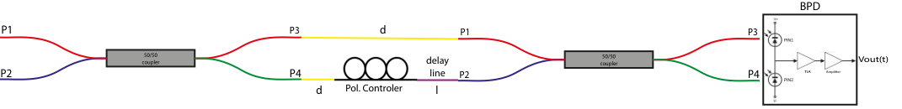
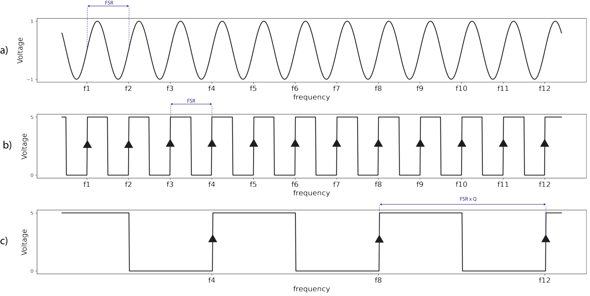

# Swept-source interferometer camera trigger (k-clock)

[](https://doi.org/10.5281/zenodo.21639219)
[](https://github.com/MarKo7s/swept-source-trigger-interferometer/releases/tag/v1.1.1)


## Project: DIY k-clock for laser-sweep synchronization

This repository has what you need to build a **k-clock** for applications such as optical coherence tomography (OCT):

1. PCB schematics
2. Firmware for trigger detection
3. SCPI command interface and Python package (**pySSTri**)

You still need the external optics and detectors: swept laser, interferometer, and balanced photodiode (BPD).

## What is a k-clock?

A **k-clock** (swept-source interferometer trigger) produces equally spaced optical-frequency samples across a fixed bandwidth by detecting zero-crossings of the interferogram $V_{\mathrm{BPD}}(\nu)$ and emitting a TTL (~5 V) edge at each crossing. Those edges mark known optical frequencies $\nu$ (or wavelengths) along the sweep.

The raw interferogram rate is set by the optical path-length mismatch between the interferometer arms. Signal conditioning and trigger generation run on a **PSoC 5LP** — a programmable SoC with a 32-bit MCU, configurable analog blocks, and programmable digital logic on one chip. This board digitally **frequency-divides** the BPD/camera trigger train by an arbitrary integer in hardware (no CPU in the divider path). Hosts talk over UART (115200 baud, CRLF). The Python package **pySSTri** wraps that protocol.

## Interferometer working principle

The laser is launched into one port of a 50/50 coupler and sweeps optical frequency $\nu$ at constant speed across a bandwidth $\Delta\nu$. After the first coupler, the field $E_{\mathrm{in}}(\nu)$ is split into $E_1(\nu)$ and $E_2(\nu)$ and recombined in a second coupler. One arm includes an extra fibre delay of length $l_{\mathrm{DLY}}$.

After balanced photodetection (BPD), TIA, and voltage amplification, the electrical interferogram is:

$$
V_{\mathrm{BPD}}(\nu) = V_0 \cdot \cos\left(2\pi\cdot\frac{1}{\mathrm{FSR}}\cdot\nu\right)
$$

$V_{\mathrm{BPD}}$ crosses zero at equally spaced optical frequencies $\nu_n$. The spacing is the **free spectral range**

$$
\mathrm{FSR} = \frac{c}{n\,l_{\mathrm{DLY}}}
\quad [\mathrm{Hz}]
$$

where $\nu$ is optical frequency, $c$ is the vacuum speed of light, and $n$ is the refractive index of the fibre (so the speed in the medium is $c/n$). Those zero crossings define the natural k-clock grid (panel a below).



*Swept-laser Mach–Zehnder interferometer used as a k-clock.*

The BPD sinusoid is conditioned into a TTL (0 → +5 V) pulse train with the same period $\mathrm{FSR}$. Each rising edge at $\nu_n$ can trigger a camera frame (panel b). The number of frames over the sweep is

$$
D_{\nu} = \frac{\Delta\nu}{\mathrm{FSR}}.
$$

This board digitally divides that TTL by an integer $Q$ in hardware, so only every $Q$-th edge is passed to the camera while keeping the same optical-frequency locations. Example with $Q = 4$: twelve raw edges become four divided triggers (panel c).



*(a) Raw BPD interferogram. (b) Rising-edge TTL after conditioning. (c) Same train after divide-by-4 ($Q=4$).*

---

## Installation (Python)

**Tagged release:**

```bash
pip install "pySSTri @ git+https://github.com/MarKo7s/swept-source-trigger-interferometer.git@v1.1.1"
```

With notebook extras:

```bash
pip install "pySSTri[notebooks] @ git+https://github.com/MarKo7s/swept-source-trigger-interferometer.git@v1.1.1"
```

**Editable (dev):**

```bash
git clone git@github.com:MarKo7s/swept-source-trigger-interferometer.git
cd swept-source-trigger-interferometer
pip install -e ".[notebooks]"
```

**Conda:**

```bash
conda create -n pySSTri_env python=3.11 -y
conda activate pySSTri_env
pip install -e ".[notebooks]"
python -m ipykernel install --user --name pySSTri_env --display-name "Python (pySSTri_env)"
```

---

## How to operate

There are two layers:

| Layer | Use when |
| ----- | -------- |
| **Firmware (UART / SCPI)** | Any host language, raw serial, or writing your own driver |
| **Python (`pySSTri`)** | Lab scripts / notebooks — preferred for day-to-day use |

Same baud rate (115200) and the same commands either way. Python methods map 1:1 onto SCPI (e.g. `SetFreqDivision(4)` → `SIG:TRIG:DIV 4`).

The board does **not** start the laser. The laser (or your control software) asserts the sweep gate `sw`; the PSoC only measures and emits camera TTL. How the **host** keeps up with sweeps falls into two patterns.

### Mode A — Asynchronous (poll / pull)

Laser sweeps on its own schedule. The host configures the board once (`SIG:TRIG:DIV`, maybe encoding), then **queries when convenient**: status, last count, frequency, or pull timestamps **after** the sweep (idle). No blocking wait on UART notify.

Typical uses: debugging, notebook checks, slow loops, “did the last sweep look OK?”

```text
  Laser ──► sw low ──► …sweep… ──► sw high
  Host  ·····························► GetSweepStatus? / GetTimestamps?
                                       (poll when idle)
```

```python
board.SetModeNormal()                 # SYS:TRIG:NOT OFF — no end-of-sweep UART dump
board.SetFreqDivision(2)
# … laser sweeps somehow …
while board.GetSweepStatus() == "1":  # optional: wait until idle
    pass
ts, ov, fc = board.GetTimestamps()    # pull buffer after the sweep
```

While `sw` is low, most commands return `ERROR: 1`; `LASER:SWE:STATUS?` still works.

### Mode B — Synchronous (notify / wait)

Enable end-of-sweep notify (`SYS:TRIG:NOT TIME|COUNT|FREQ|ALL|TIMESTAMP`). When each sweep finishes, the board **pushes** a line (or a `TSU` frame) on UART.

Typical pattern: a **watcher thread** blocks on `waitForSignal()` / `readline`; the **main thread** runs the laser (or other work) and syncs with `done.wait()` when the notify arrives — so UART wait does not block the main thread.

```mermaid
sequenceDiagram
    participant Main as Main thread
    participant Watch as Watcher thread
    participant Board as PSoC board
    participant Laser

    Main->>Board: SYS:TRIG:NOT COUNT
    Main->>Watch: start (waitForSignal)
    Main->>Laser: start_sweep()
    Laser->>Board: sw low … sw high
    Board-->>Watch: notify line
    Watch->>Main: done.set()
    Main->>Main: done.wait() returns; continue
```

```python
import threading

done = threading.Event()

def watch_sweep_done():
    board.waitForSignal()   # blocks only this thread on UART notify
    done.set()

board.SetModeCount()
board.flushSerialBuffer()
threading.Thread(target=watch_sweep_done, daemon=True).start()

laser.start_sweep()         # main owns the sweep / other work
done.wait(timeout=30.0)     # sync when board says sweep finished
```

For timestamp notify on the watcher thread, use `waitTimestamps()` instead of `waitForSignal()`.

| | Mode A (async) | Mode B (sync) |
| - | -------------- | ------------- |
| Notify | `SYS:TRIG:NOT OFF` | `TIME` / `COUNT` / `FREQ` / `ALL` / `TIMESTAMP` |
| Host API | `GetSweepStatus`, `GetTimestamps`, … | watcher: `waitForSignal` / `waitTimestamps`; main: `Event.wait` |
| Timing | Host decides when to ask | Main syncs when end-of-sweep notify arrives |
| Best for | Inspection, scripts | Acquisition loops without blocking main on UART |

Always `flushSerialBuffer()` after changing notify mode so a stale line does not satisfy the next `wait`.

---

## Firmware

### Which project to flash

Firmware is **variant-specific** (polarity / laser). Pick the folder under `psoc5/firmware/` that matches your hardware:

| Project | Role |
| ------- | ---- |
| `PSOC_trigger_firmware_Trigger_Polarity_Low` | **Production** (FW 1.3.1) — active-low LEVEL sweep gate + timestamps |
| `PSOC_trigger_firmware_DEBUG` | Experimental |

Production firmware is tuned for an **active-low** sweep gate. Other lasers or trigger polarities can be supported on request (see [Contact](#contact)).

### Install tools and flash

1. Install [PSoC Programmer](https://softwaretools.infineon.com/tools/com.ifx.tb.tool.psocprogrammer). If it asks to update the kit / MiniProg firmware, allow that, then **close** Programmer.
2. Install [PSoC Creator](https://www.infineon.com/cms/en/design-support/tools/sdk/psoc-software/psoc-creator/) (Cypress / Infineon).
3. In Creator, open the workspace for the project you chose, e.g. production:

   `psoc5/firmware/PSOC_trigger_firmware_Trigger_Polarity_Low/Trigger_PSOC5.cywrk`

4. Connect the board (USB / MiniProg as wired on your PCB).
5. Build if needed, then **Debug → Program**.
6. Verify over UART (115200 baud, CRLF): send `*IDN?` — it should report firmware version and date (e.g. FW 1.3.1). With Python: `board.ID()` after `connect()`.

Host control after flashing: see [Installation (Python)](#installation-python) and `trigger_example.ipynb`.

### Sweep gate (Polarity Low)

The sweep input `sw` is **active-low LEVEL**, not a falling-edge pulse:

- **Sweeping** while `sw` is held low
- **Idle** while `sw` is high

While sweeping, most commands return `ERROR: 1`. Exception: `LASER:SWE:STATUS?` (`1` = sweeping, `0` = idle).

### Command reference

Lines end with `\r\n`. Sets reply `OK` (or `OK - WARNING: …`). Queries reply a value. Errors: `ERROR: 0` (bad command), `ERROR: 1` (busy / sweeping).


| Command                            | Meaning                                       |
| ---------------------------------- | --------------------------------------------- |
| `*IDN?`                            | Identify                                      |
| `SIG:TRIG:DIV <n>` / `?`           | Camera trigger divider (default `2`)          |
| `SIG:TRIG:EVENTS:COUNT?`           | Trigger count last sweep                      |
| `SIG:TRIG:EVENTS:FREQ?`            | Mean trigger rate [Hz] (first→last timestamp) |
| `SIG:TRIG:TIMESTAMP?`              | Pull timestamp buffer (idle only)             |
| `LASER:SWE:TIME?`                  | Sweep duration [µs]                           |
| `LASER:SWE:COUNT?` / `0` / `RESET` | Cumulative sweeps / clear                     |
| `LASER:SWE:STATUS?`                | `1` sweeping / `0` idle                       |
| `SYS:TRIG:NOT <mode>` / `?` | Notify mode: `OFF`, `TIME`, `COUNT`, `FREQ`, `ALL`, `TIMESTAMP` |
| `SYS:TIMESTAMP:DELTAENC <mode>` / `?` | Packing: `OFF`, `UINT8`, `UINT16` (aliases `0`, `1`, `2`) |


### Timestamps

Each camera-trigger edge is stamped by a 24 MHz Timer during the sweep (ISR fill, up to **4000** samples). Values are **µs from sweep start**.

**Typical flow**

1. Optionally set packing: `SYS:TIMESTAMP:DELTAENC UINT16` (see delta encoding below).
2. Run a sweep (or enable `SYS:TRIG:NOT TIMESTAMP` for an automatic dump each sweep).
3. When idle: `SIG:TRIG:TIMESTAMP?` → one ASCII header line + binary payload.

**Wire header** (always the same fields):

```
TSU <n> <ov> <fc> <t0> <enc>\r\n
```


| Field | Meaning                                         |
| ----- | ----------------------------------------------- |
| `n`   | Number of timestamps                            |
| `ov`  | `1` if buffer overflowed or a delta was clamped |
| `fc`  | Hardware event count for the sweep              |
| `t0`  | First sample [µs]                               |
| `enc` | Packing mode (`0` / `1` / `2`) — always last    |


Then the **payload** depends on `enc`:


| `enc` | Name           | Payload                     | Host reconstruct           |
| ----- | -------------- | --------------------------- | -------------------------- |
| `0`   | OFF (absolute) | `n × uint32` LE absolute µs | use as-is                  |
| `1`   | UINT8 deltas   | `(n−1) × uint8` gaps        | `t[0]=t0`, then accumulate |
| `2`   | UINT16 deltas  | `(n−1) × uint16` LE gaps    | same accumulate            |


Delta encoding shrinks UART traffic when consecutive gaps are small. Choose a mode whose **max gap** fits your laser:


| Mode   | Max gap       | Safe if trigger rate |
| ------ | ------------- | -------------------- |
| UINT8  | 255 µs        | **≥ ~3.9 kHz**       |
| UINT16 | 65535 µs      | **≥ ~15 Hz**         |
| OFF    | (full uint32) | any                  |


If a gap is too large for the mode, firmware **clamps** it and sets `ov=1` (lossy). For ~3 kHz SS sources, prefer **UINT16** or **OFF**, not UINT8.

Setting the mode returns a warning with those limits, e.g.:

```
SYS:TIMESTAMP:DELTAENC 2
→ OK - WARNING: max_dt_us=65535 min_freq_hz=15
```

**False triggers:** noisy interferogram / BPD edges can create extra timestamps. A hardware **deglitch** filter is planned but not in this firmware yet — raise the comparator threshold / SNR, or filter bad gaps in software for now.

### Hardware (PCB)

Eagle schematics and board files: `pcb/Eagle_project/Trigger_PSOC5LP`.

---

## Python interface (`pySSTri`)

Example notebook: `trigger_example.ipynb`.

### Connect

```python
from pySSTri import SSTriggerInterferometer

board = SSTriggerInterferometer()   # or COM="COM6"
board.connect()                     # autodiscovers via *IDN? if needed
board.discoverMethods()             # list wrappers
print(board.ID())
```

### Everyday control

See [How to operate](#how-to-operate) for async poll vs sync wait. Short sync example:

```python
board.SetFreqDivision(2)
board.SetModeCount()                # notify: trigger count each sweep
board.flushSerialBuffer()
print(board.waitForSignal())        # blocks for next notify line
print(board.GetSweepStatus())       # "0" / "1"
print(board.GetFrequency(), board.GetSweepTime())
```

### Timestamps (decoded to absolute µs for you)

```python
board.SetTimestampsEncoding(2)      # UINT16 deltas on the wire (FW aliases OK)
# board.SetModeTimestamp()          # optional: auto-dump each sweep
# ts, ov, fc = board.waitTimestamps()

ts, ov, fc = board.GetTimestamps()  # after a sweep, while idle
# ts: uint32 array [µs], regardless of enc in the header
```

`GetTimestamps` / `waitTimestamps` read the `TSU` header’s `enc` field and unpack the payload — you always get absolute times.

---

## Repository layout

```
pySSTri/          Python package
psoc5/firmware/   PSoC Creator projects
pcb/              Eagle schematics
trigger_example.ipynb
scripts/release.py
CITATION.cff      GitHub / Zenodo cite metadata
CITATION.bib      BibTeX for manuscripts
```

---

## Developer notes

### Versioning

The package version is defined in **one place only**: `pyproject.toml` → `[project].version`.

Do **not** edit `pySSTri/__init__.py` on each release. `pySSTri.__version__` is read from pip metadata after install (`importlib.metadata`).

Check the installed version:

```bash
pip show pySSTri
python -c "import pySSTri; print(pySSTri.__version__)"
```

Use [semantic versioning](https://semver.org/): `MAJOR.MINOR.PATCH`.

Firmware has its own identity (`FW_VERSION` / `FW_DATE` in `main.c`, reported by `*IDN?`). Bump that when you change the PSoC image; it is independent of the pySSTri package version.

Default git branch is `main`.

### Releasing a new version

1. Add a `## [X.Y.Z] - YYYY-MM-DD` section at the top of `CHANGELOG.md` (keep `## [Unreleased]` above it for WIP notes).
2. Set `version = "X.Y.Z"` in `pyproject.toml`.
3. Commit everything (clean working tree).
4. From the repo root:

```bash
python scripts/release.py --from-changelog
```

The script reads the version from `pyproject.toml`, pushes `main`, creates annotated git tag `vX.Y.Z`, and pushes the tag. With `--from-changelog`, the tag message is taken from the matching `CHANGELOG.md` section. Override with `--message "..."` if needed.

Dry run (no git changes):

```bash
python scripts/release.py --from-changelog --dry-run
```

Optional GitHub Release page (`gh` CLI):

```bash
gh release create vX.Y.Z --title "pySSTri X.Y.Z" --notes-file CHANGELOG.md
```

After release, others install with:

```bash
pip install "pySSTri @ git+https://github.com/MarKo7s/swept-source-trigger-interferometer.git@vX.Y.Z"
```

**Requirements:** clean working tree; tag `vX.Y.Z` must not already exist on GitHub.

## Contact

Marcos Maestre Morote — [m.maestremorote@uq.edu.au](mailto:m.maestremorote@uq.edu.au)

Questions, bug reports, or requests to adapt the firmware to a different swept laser / sweep-gate polarity are welcome.

## License

This project is licensed under the [MIT License](LICENSE). Copyright (c) 2026 Marcos Maestre Morote.

## Citation

Use these identifiers in the manuscript so Methods, Supplementary, and the bibliography stay consistent.

### Versions to tag

| Item | Value to cite |
| ---- | ------------- |
| Software / archive | **pySSTri v1.1.1** |
| Git tag | `v1.1.1` |
| Zenodo DOI | [10.5281/zenodo.21639219](https://doi.org/10.5281/zenodo.21639219) |
| Production firmware | **Polarity Low 1.3.1** (`*IDN?` / `board.ID()`) |
| BibTeX key | `MaestreMorote2026pySSTri` (see [`CITATION.bib`](CITATION.bib)) |

### BibTeX (drop into your `.bib`)

```bibtex
@software{MaestreMorote2026pySSTri,
  author       = {Maestre Morote, Marcos},
  title        = {{Swept-source interferometer camera trigger (pySSTri)}},
  year         = {2026},
  publisher    = {Zenodo},
  version      = {v1.1.1},
  doi          = {10.5281/zenodo.21639219},
  url          = {https://doi.org/10.5281/zenodo.21639219},
  note         = {Firmware Polarity Low 1.3.1; source https://github.com/MarKo7s/swept-source-trigger-interferometer}
}
```

LaTeX: `\cite{MaestreMorote2026pySSTri}`. Word / EndNote: import the DOI or use the formatted reference below.

### Formatted reference

> Marcos Maestre Morote. *Swept-source interferometer camera trigger (pySSTri)*. Zenodo (2026). Version v1.1.1. https://doi.org/10.5281/zenodo.21639219

### Paste into Methods

Adapt to your tense/house style; keep the cite key and versions:

> Wavelength / optical-frequency sampling during each laser sweep was provided by a fibre Mach–Zehnder k-clock interferometer and balanced photodiode. Zero-crossing edges were conditioned into a TTL train and divided by an integer $Q$ in hardware on a custom PSoC 5LP camera-trigger board. Instrument control used the open-source package pySSTri (v1.1.1; firmware Polarity Low 1.3.1) \cite{MaestreMorote2026pySSTri}.

### Paste into Supplementary

> **Trigger interferometer and camera timing.** The auxiliary k-clock path is a fibre Mach–Zehnder interferometer with fixed delay; the balanced-photodiode interferogram is converted to a TTL pulse train at the free-spectral-range spacing. A PSoC 5LP board performs hardware frequency division of that train and exposes sweep timing over UART (115200 baud, SCPI-like commands). Host software was **pySSTri** v1.1.1 (GitHub tag `v1.1.1`), archived at Zenodo (DOI: 10.5281/zenodo.21639219), with production firmware **Trigger Polarity Low** 1.3.1. Schematics, firmware, and the Python interface are available under the MIT License at https://github.com/MarKo7s/swept-source-trigger-interferometer. Further protocol details (notify vs poll modes, timestamp frames) are documented in the repository README.

GitHub also exposes **Cite this repository** from [`CITATION.cff`](CITATION.cff).
